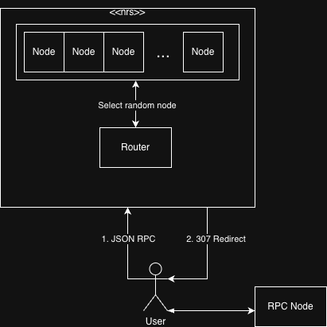

# nrs.pub

**Node Resolution Service — Public RPC node resolution and smart routing for any blockchain.**

[Website](https://nrs.pub) | [GitHub](https://github.com/saefstroem/nrs.pub) | [X / Twitter](https://x.com/saefstroem)

---

## What is NRS?

NRS (Node Resolution Service) is a free, open-source service that resolves the best available public RPC endpoint for any supported blockchain. Instead of hardcoding a single RPC URL into your application, point it at `nrs.pub/<chain_id>` and get routed to a healthy, vetted public node — every time, a different one.

No API keys. No accounts. No SDK. One URL per chain.

```diff
- const rpc = "https://eth-mainnet.g.alchemy.com/v2/YOUR_KEY";
+ const rpc = "https://nrs.pub/1";
```

NRS works with anything that follows HTTP redirects: ethers.js, viem, web3.py, curl, wagmi, or any standard JSON-RPC client.

---

## Why NRS Exists

### The Single Point of Failure Problem

Most applications hardcode a single RPC provider. When that provider goes down, so does the application. When that provider is compromised, the application is exposed.

This is not a theoretical risk.

### The KelpDAO Incident — April 18, 2026

On April 18, 2026, attackers linked to North Korea's Lazarus Group stole approximately $292 million (116,500 rsETH) from KelpDAO's LayerZero bridge. This was not a smart contract exploit. It was an infrastructure attack targeting the RPC nodes that KelpDAO's verification network relied on.

The attack worked as follows:

1. KelpDAO's bridge used a LayerZero DVN (Decentralized Verifier Network) configured with a single verifier — a 1-of-1 setup with no independent redundancy.
2. The attackers compromised two internal RPC nodes operated by LayerZero Labs, replacing their software with modified versions that returned forged blockchain state.
3. Simultaneously, a DDoS attack knocked out the external RPC nodes the DVN depended on as fallback.
4. With only the compromised nodes reachable, the DVN was fed fabricated data showing a token burn on the source chain that never occurred.
5. The Ethereum-side contract released 116,500 rsETH against a phantom burn. Every on-chain transaction appeared valid.

The compromised nodes were engineered to self-destruct after the attack window, wiping binaries, logs, and configurations. A follow-up attempt to drain an additional ~$95 million was blocked only because KelpDAO detected the anomaly and paused contracts in time.

**The root cause was simple: a single, predictable RPC dependency with no rotation and no redundancy.**

NRS exists to make this class of failure structurally harder. By randomizing which node serves each request, there is no single endpoint to compromise, no fixed target to DDoS, and no predictable routing pattern for an attacker to exploit.

---

## How It Works

NRS uses HTTP 307 (Temporary Redirect) to route your request to a healthy public node. NRS never proxies your traffic — it tells your client where to go, then gets out of the way.





### Key Properties

- **No proxy overhead.** NRS returns a redirect. Your client connects directly to the node. NRS never sees your request payload or the node's response.
- **Random node selection.** Each request is routed to a randomly selected node from the healthy pool. There is no round-robin, no sticky sessions, no predictable pattern.
- **Background health monitoring.** Nodes are continuously evaluated for availability and performance. Unhealthy nodes are automatically excluded from the pool until they recover.
- **Manual curation.** All nodes in the pool are carefully selected and evaluated based on the reputation of the node provider. Nodes are added and removed manually based on ongoing performance monitoring.

---

## Supported Chains

NRS currently supports **EVM-compatible chains** across mainnet and testnet networks. The full list with live status, latency, error rate, and 24-hour uptime history is available at:

**[nrs.pub/chains](https://nrs.pub/chains)**

Examples:

| Chain | Endpoint |
|---|---|
| Ethereum Mainnet | `https://nrs.pub/1` |
| BNB Smart Chain | `https://nrs.pub/56` |
| Polygon | `https://nrs.pub/137` |
| Arbitrum One | `https://nrs.pub/42161` |
| Base | `https://nrs.pub/8453` |
| Avalanche C-Chain | `https://nrs.pub/43114` |
| Optimism | `https://nrs.pub/10` |
| Linea | `https://nrs.pub/59144` |

The endpoint format is always `https://nrs.pub/<chain_id>`.

### Missing a Chain?

If a chain you need is not listed, open a PR on the [GitHub repository](https://github.com/saefstroem/nrs.pub) and it will be considered for inclusion. Chains are evaluated based on demand, availability of reputable public nodes, and maintainability.

---

## Usage

### Quick Start

Replace your existing RPC URL with the NRS endpoint for your chain. That's it.

**ethers.js**
```javascript
import { JsonRpcProvider } from "ethers";
const provider = new JsonRpcProvider("https://nrs.pub/1");
const block = await provider.getBlockNumber();
```

**viem**
```typescript
import { createPublicClient, http } from "viem";
import { mainnet } from "viem/chains";

const client = createPublicClient({
  chain: mainnet,
  transport: http("https://nrs.pub/1"),
});
```

**web3.py**
```python
from web3 import Web3
w3 = Web3(Web3.HTTPProvider("https://nrs.pub/1"))
print(w3.eth.block_number)
```

**curl**
```bash
curl -L -X POST https://nrs.pub/1 \
  -H "Content-Type: application/json" \
  -d '{"jsonrpc":"2.0","method":"eth_blockNumber","params":[],"id":1}'
```

> **Note:** The `-L` flag (follow redirects) is required for curl. Most HTTP libraries and Web3 SDKs follow redirects by default.

---

## Limitations and Considerations

### Unsupported Operations

Because NRS randomly routes each request to a different node, **stateful JSON-RPC methods are not supported**. These methods require multiple requests to hit the same node, which NRS cannot guarantee.

Unsupported methods include:

- `eth_newFilter` / `eth_newBlockFilter` / `eth_newPendingTransactionFilter`
- `eth_getFilterChanges` / `eth_getFilterLogs` / `eth_uninstallFilter`

For filter-based workflows, use a direct RPC connection or a WebSocket provider.

### Rate Limits

NRS itself does not impose rate limits. However, since your client connects directly to the underlying node after the redirect, **you are subject to whatever rate limits that individual node operator enforces**. These limits vary per provider and may differ from any aggregate statistics displayed on the NRS website.

### NRS Is Not a VPN

The 307 redirect means your client establishes a direct connection to the resolved node. **NRS does not proxy, tunnel, or mask your traffic.** The node operator will see your IP address and request payload.

### Privacy Recommendations

NRS does not store any logs or request data. We simply return a 307 redirect. However, **we have no control over what individual node operators do with the data they receive** — including logging IP addresses, request payloads, or transaction data.

**It is recommended to use a VPN when using NRS** if you want to avoid potential tracking by node operators.

### Node Privacy

Some nodes in the pool are operated by private providers who have shared their endpoints with NRS under the condition that their infrastructure details remain confidential. As such, **we do not publish the exact IP addresses or URLs of individual nodes in the pool.** Some nodes may also be behind proxies or load balancers.

---

## Acceptable Use Policy

NRS is a free public service. The following uses are prohibited:

- **Node enumeration.** Any attempt to systematically discover, map, or enumerate which nodes are in the NRS pool is prohibited. This includes sending high volumes of requests to fingerprint node responses, timing attacks, or any other technique designed to identify backend infrastructure.
- **Abuse or attacks.** Using NRS as an amplification vector, for DDoS attacks against node operators, or for any illegal activity.

Violations will result in IP blacklisting. Automated detection is in place.

---

## Architecture

NRS is a lightweight Rust service built on [Axum](https://github.com/tokio-rs/axum). The architecture is intentionally minimal:

```
┌─────────────────────────────────────────────────────┐
│                     nrs.pub                         │
│                                                     │
│  ┌───────────┐    ┌──────────────┐    ┌──────────┐  │
│  │   Axum    │    │  RPC Storage │    │ Monitor  │  │
│  │  Router   │───▶│  (in-memory) │◀───│ (bg task)│  │
│  └───────────┘    └──────────────┘    └──────────┘  │
│       │                                     │       │
│       │ 307 redirect                        │       │
│       ▼                                     │       │
│  ┌──────────┐                      health checks    │
│  │  Client  │                      against all      │
│  └──────────┘                      nodes            │
│       │                                             │
│       │ direct connection                           │
│       ▼                                             │
│  ┌──────────┐                                       │
│  │ RPC Node │                                       │
│  └──────────┘                                       │
└─────────────────────────────────────────────────────┘
```

### Components

- **Axum Router** — Receives incoming requests at `/:chain_id`, selects a random healthy node from the pool, and returns a 307 redirect.
- **RPC Storage** — In-memory store of all chains and their associated RPC endpoints, loaded from a curated JSON configuration.
- **Monitor** — Background task that continuously health-checks all nodes by issuing `eth_chainId` calls with a 3-second timeout. Nodes that fail are temporarily excluded from routing.

### Node Selection

Node selection uses cryptographically random indexing into the candidate pool. When a request arrives:

1. The chain is looked up by `chain_id`.
2. A random index is generated.
3. The node at that index is health-checked with a lightweight `eth_chainId` call.
4. If healthy, a 307 redirect is returned. If not, the node is removed from the candidate set and another is selected.
5. If all nodes for a chain are down, a 500 error is returned.

This approach ensures that an attacker cannot predict or control which node will serve any given request.

---

## Security Model

NRS is not a security product. It is an infrastructure primitive that reduces certain classes of risk through randomization and redundancy.

### What NRS mitigates

- **Single point of failure.** If one node goes down, the next request hits another. No failover configuration needed.
- **Targeted node compromise.** An attacker cannot predict which node will serve a safety-critical call. Compromising one node in the pool does not compromise all requests.
- **Provider-level outages.** Nodes from multiple independent providers are included in each chain's pool.

### What NRS does not mitigate

- **Malicious node responses.** NRS does not validate the correctness of responses returned by nodes. If a node in the pool returns false data, NRS will not detect it. For safety-critical operations (bridges, large transfers), applications should implement their own response validation or use the multi-call pattern: issue the same call 3 times through NRS — each request hits a different node — and compare results client-side.
- **Privacy.** NRS does not hide your traffic from node operators. Use a VPN.
- **Consensus.** NRS provides resolution, not verification. A future `/consensus` endpoint is under consideration for proxied, multi-node verified responses.

## When should you use NRS?
Use NRS when you need a quick, reliable RPC endpoint and don't want to think about provider selection, API keys, or failover configuration. NRS is designed for developers and teams who want to start building immediately without shopping for RPC providers.
Good use cases

Prototyping and development. You're spinning up a new project and need an RPC endpoint in 10 seconds, not 10 minutes of provider comparison and key registration.
Multi-chain applications. Your app supports 20+ chains. Instead of managing 20 provider accounts and API keys, use nrs.pub/<chain_id> for all of them.
Scripts, bots, and tooling. One-off scripts, monitoring tools, CLI utilities — anything where setting up a dedicated provider account is overkill.
Redundancy and failover. You already have a primary RPC provider but want a zero-config fallback. Point your failover logic at NRS and get automatic multi-node routing for free.
Open-source projects. Ship your project with a working default RPC that doesn't require users to register for an API key before they can run your code.
Education and workshops. Teaching Solidity, running a hackathon, or writing a tutorial. Participants can follow along without provider signup friction.

### When NRS is not the right choice

High-frequency trading or MEV. You need deterministic latency, private mempools, or transaction ordering guarantees. Use a dedicated provider with SLA commitments.
Stateful RPC operations. If your application relies on eth_newFilter, eth_getFilterChanges, or any method that requires consecutive requests to hit the same node, NRS will break your workflow. Use a direct connection instead.
Archive node queries. NRS routes to whatever healthy node is available. There is no guarantee that the resolved node is an archive node. If you need historical state at arbitrary block heights, use a provider that explicitly offers archive access.
Privacy-critical operations. NRS redirects your client directly to the node — your IP and payload are visible to the node operator. If you require end-to-end privacy, use a VPN in combination with NRS or connect through a provider whose privacy policy you have verified.

---

## Comparison

| | Traditional RPC | NRS |
|---|---|---|
| Single point of failure | Yes | No — random node per request |
| API keys required | Usually | Never |
| Failover configuration | Manual | Automatic |
| Node health monitoring | Your responsibility | Built-in |
| Traffic proxied | Depends | Never — 307 redirect |
| Stateful filters | Supported | Not supported |
| Cost | Free tier / paid | Free |

---

## Roadmap

- **`/consensus` endpoint** — Proxied, multi-node verified responses for safety-critical operations. Paid tier.
- **Non-EVM chain support** — Kaspa, Bitcoin, Solana, and other non-EVM networks.
- **Node reputation scoring** — Public quality index per node based on latency, uptime, and response consistency.
- **WebSocket support** — Persistent connections with smart routing.

---

## Contributing

Contributions are welcome. The main ways to help:

- **Add a chain.** Open a PR with the chain configuration. Include the chain ID, name, and a list of reputable public RPC endpoints.
- **Report a bad node.** If you encounter consistently incorrect or degraded responses from NRS for a specific chain, open an issue.
- **Improve documentation.** PRs for docs, examples, and integration guides are appreciated.

---

## Donate

NRS is free and has no paid tier. If you find it useful, consider donating to help cover infrastructure costs.

[nrs.pub/donate](https://nrs.pub/donate)

---

## License

MIT

---

Built by [@saefstroem](https://x.com/saefstroem).